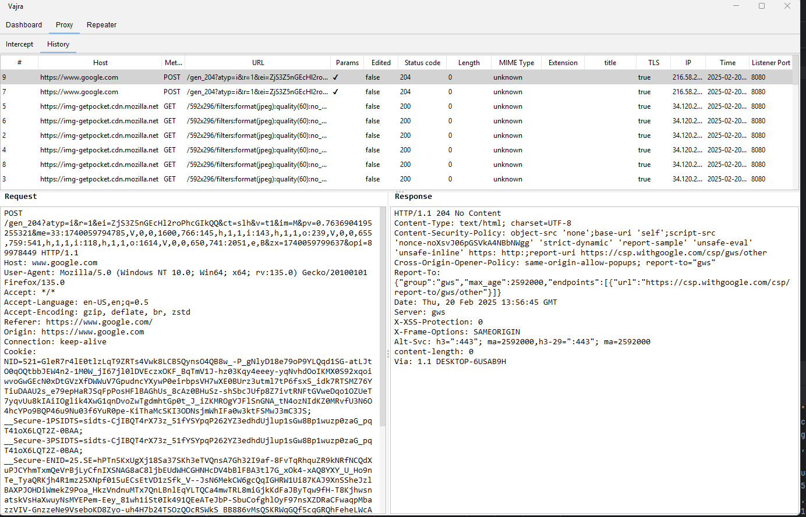

# Vajra - Web Security Testing Tool

Vajra is a powerful web security testing tool built in Java that provides features like HTTP request interception, history tracking, and request repeating capabilities.


---

<center></center>

---
## 📖 Table of Contents

- [Installation](#installation)
- [Usage](#usage)
- [Features](#features)
- [Screenshots](#screenshots)
- [Contributing](#contributing)
- [License](#license)
- [Contact](#contact)
---
## Features

- HTTP/HTTPS Traffic Interception
- Request/Response History Logging
- Request Repeater Functionality 
- TLS Support
- Customizable Proxy Settings
- Request/Response Viewer with Syntax Highlighting
---
## Installation

### Prerequisites
- Java 11 or higher
- Maven

### Steps
1. Clone the repository

```
git clone https://github.com/axomsec/Vajra.git
cd Vajra
```

2. Build the project

`mvn clean install`

3. Run the application

````
java -jar target\Vajra-1.0-SNAPSHOT.jar
````
---
## Usage

### Intercepting HTTP/HTTPS Traffic

1. Start the proxy server
bash
java -jar target/vajra-1.0-SNAPSHOT.jar

2. Configure your browser to use the proxy server (exactly like you configure for BurpSuite)

### Request/Response History

1. Intercepted requests and responses are logged in the history table
2. Click on a request to view the details

### Request Repeater
(This feature is not ready/implemented yet)
1. Select a request from the history table
2. Click the "Send to Repeater" button
3. The request will be sent to the repeater and the response will be displayed in the response viewer

### Proxy Settings

1. Configure the proxy settings in the settings panel   

---
## Screenshots
1. [HTTP History](screenshots/http_history.png)
2. [Intercept](screenshots/http_history.png)
3. [Settings](screenshots/export_ca_cert.png)


---
## Contributing
I have heard the open-source community is magical? Your contribution matters and i am openly looking for contributors.
1. Fork the repository
2. Create a new branch
3. Make your changes and commit them
4. Push your changes to your fork
5. Create a pull request


📧 **Email:** [rony@axomsec.com](mailto:rony@axomsec.com)
<br>Feel free to hit me up with an email. 

## License

This project is licensed under the MIT License. See the LICENSE file for details.


